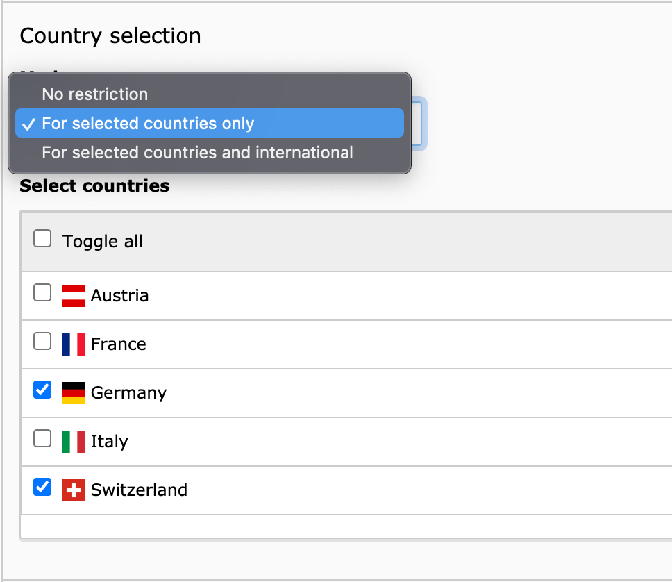
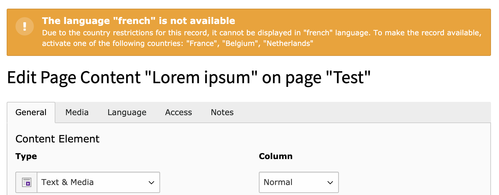
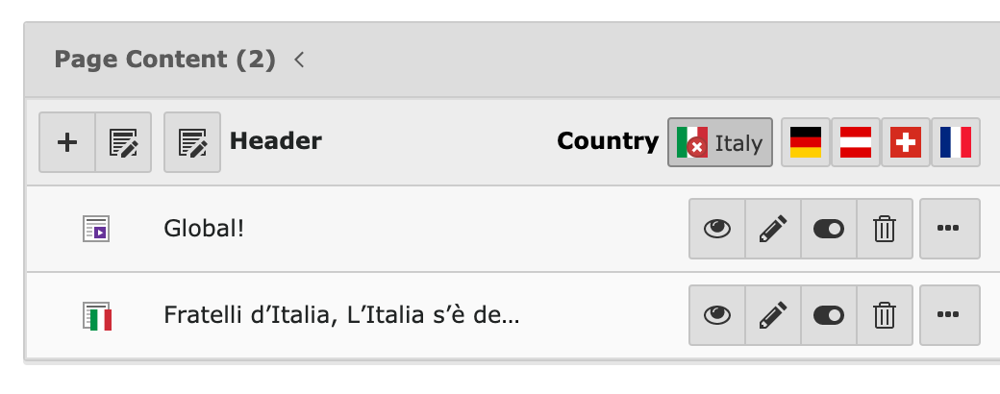

# Countries :jp: :us: :fr: :es: :it: :ru: :gb: :de:

**This TYPO3 extension offers the possibility of a flexible country configuration for single tree content.**

Languages that exist in TYPO3 can be split up to match single countries.
You can therefore limit content of different languages to only be displayed for chosen countries.
For a clean and easy to understand administration in the backend, this extension uses dynamic icons, country filters and more.

## Example usage:

Let‘s take the German language. With this extension it’s possible to subdivide the language “German” into the countries “Germany”, “Austria” and “Switzerland” in order to limit selected content to individual countries.
In this example, in addition to the German language URL of the website (`example.com/de/path`), other URLs are automatically available:

* `example.com/de-de/schweiz`
* `example.com/de-at/schweiz`
* `example.com/de-ch/schweiz`

Now, if a content element, a page or any other database record has exclusively been made available for the country Switzerland, it would only be available under `example.com/de-ch/schweiz` (note the **de-ch**) but not on the other example urls.

In this example, the content restricted to Switzerland could also be available in other translations, so it can be viewed in other languages:

* `example.com/en-ch/switzerland`
* `example.com/it-ch/la-suisse`
* `example.com/fr-ch/svizzera`

## How it works:

With every country that is assigned to a language, the language is made available under an additionally altered base URL. This consists of both the ISO Code of the language and the country.

When accessing a page with a language country combination like that in the URL, all database queries on configured tables will be made with these country restrictions in mind.

## SEO:

There’s no need to worry here. Aside from the URLs, the hreflang as well as the lang attribute of the page are getting altered. This way, the search engines find a perfectly fine identifiable and correct country variation. To put it simple: there will be no duplicate content complaints.

### Examples for hreflang tags:

```html
<link rel="alternate" hreflang="en" href="https://example.com/path"/>             <!-- english content -->
<link rel="alternate" hreflang="en-AT" href="https://example.com/en-at/path"/>    <!-- english content for Austria -->
<link rel="alternate" hreflang="en-CH" href="https://example.com/en-ch/path"/>    <!-- english content for Switzerland -->
<link rel="alternate" hreflang="en-DE" href="https://example.com/en-de/path"/>    <!-- english content for Germany -->
<link rel="alternate" hreflang="de" href="https://example.com/de/path"/>          <!-- german content -->
<link rel="alternate" hreflang="de-AT" href="https://example.com/de-at/path"/>    <!-- german content for Austria -->
<link rel="alternate" hreflang="de-CH" href="https://example.com/de-ch/path"/>    <!-- german content for Switzerland -->
<link rel="alternate" hreflang="de-DE" href="https://example.com/de-de/path"/>    <!-- german content for Germany -->
<link rel="alternate" hreflang="fr" href="https://example.com/fr/path"/>          <!-- french content -->
<link rel="alternate" hreflang="fr-FR" href="https://example.com/fr-fr/path"/>    <!-- french content for France-->
<link rel="alternate" hreflang="fr-BE" href="https://example.com/fr-be/path"/>    <!-- french content for Belgium-->
...
```

## For administrators:

### Installation:

Get the extension via composer: `composer require zeroseven/z7-countries`

### Configuration:

1. On root level (`uid:0`), create a various amount of countries as data records.
2. Assign countries to the languages via the TYPO3 site config.
3. Extend desired data record types for restricting to countries. Example:

```php
\Zeroseven\Countries\Service\TCAService::registerPalette('tx_news_domain_model_news');
```

:bulb: _The database analyzer in the install tool will automatically add the needed fields to your database when running it._

## Editor:

### Adjust country settings for a data record:

If the data record type has been made available for country configuration, the record can now be restricted to specific countries.



### Language/country check:

When creating or editing a data record, there will be checks if it’s even displayed under current country settings in the chosen language.
This way, you can avoid any wasted efforts on misleading configuration.



### Country filter:

In the list module, there’s a filter available for you.
Now you can check which content is available for any chosen country without any effort.



## Upcoming features:

We are currently still in development with this extension. In the near future, you can expect more features, like:

* Middleware for automatic redirects
* Country menu via a simple viewHelper and dataprocessor
* Extended language menu via a viewHelper and dataprocessor
* A country condition viewHelper
